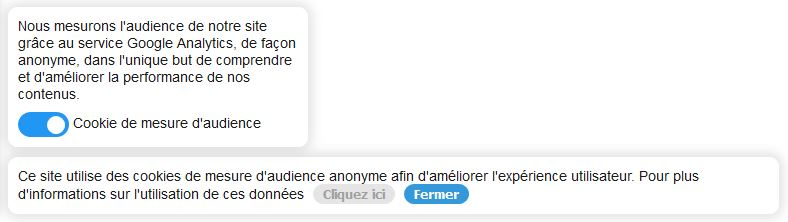

# Cookie Consent

Minimalist cookie consent bar and popup, GDPR compliant only for audience analytics



Demo is available here: [Github page](https://nicolasbrondin.github.io/cookie-consent/test/index.html)

## Installation

You can host the script yourself, or rely on the github hosted version. Then the only things you need is to initialize the CookieConsent instance with your tracking code : 
```
<script src="https://www.googletagmanager.com/gtag/js?id=UA-XXXXXXXX-X"></script>
<script src="https://github.com/NicolasBrondin/cookie-consent/releases/download/v0.0.1/main.js"></script>
<script>
    new CookieConsent(function(){
        window.dataLayer = window.dataLayer || [];
        function gtag(){dataLayer.push(arguments);}
        gtag('js', new Date());
        gtag('config', 'UA-XXXXXXXX-X', { 'anonymize_ip': true });
    });
</script>
```

You should be up and running, with the cookie bar displaying correctly

## Tools

- Vanilla JS
- Webpack

## How does it work ?

The widget load after document is ready. It checks if consent was already given or not (default is true only for audience analytics), if consent is true then it loads the analytics script. Whenever the user refuse cookies, it will set consent to false and reload the page (only way to unload analytics script correctly). If user changes its mind and agrees, analytics script will load at this very moment.

## Contribute

For now the widget is only available in French, feel free to add i18n and make PRs, I will be heppy to merge them !
